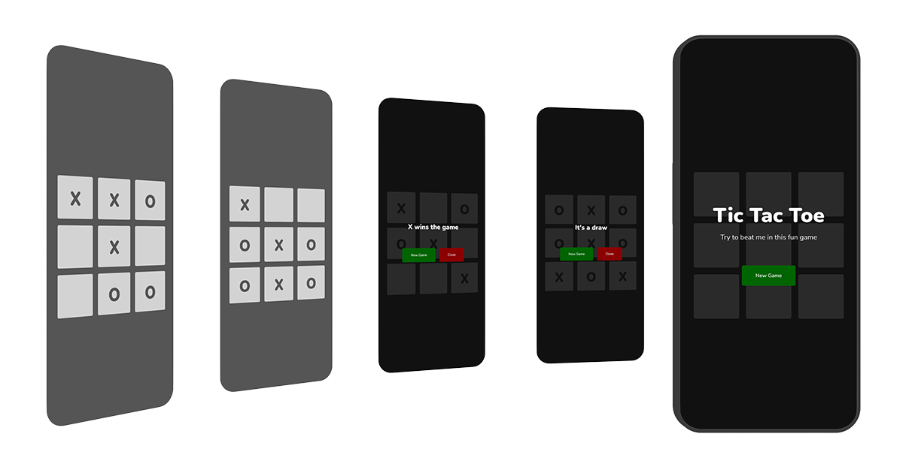

# Let's play some Tic Tac Toe!

Play Tic Tac Toe game against AI player. First player taking three in a row wins the game.\
Game is developed in [React](https://reactjs.org/). AI Player simply checks available fields and using math function generates random index. Using [Minimax Algorithm](https://en.wikipedia.org/wiki/Minimax) would result in unbeatable AI Player and winning is fun, isn't it? :)
Start game by clicking [here](https://btopolnjak.github.io/react-tictactoe-game/)

### Links
- Website - [Boris Topolnjak](https://github.com/btopolnjak)
- LinkedIn - [@boris-topolnjak](https://www.linkedin.com/in/boris-topolnjak-23334b104/)

### Available Scripts for Developers

In the project directory, you can run:

#### `npm start`

Runs the app in the development mode.\
Open [http://localhost:3000](http://localhost:3000) to view it in your browser.

The page will reload when you make changes.\
You may also see any lint errors in the console.

#### `npm test`

Launches the test runner in the interactive watch mode.\
See the section about [running tests](https://facebook.github.io/create-react-app/docs/running-tests) for more information.

#### `npm run build`

Builds the app for production to the `build` folder.\
It correctly bundles React in production mode and optimizes the build for the best performance.

The build is minified and the filenames include the hashes.\
Your app is ready to be deployed!

See the section about [deployment](https://facebook.github.io/create-react-app/docs/deployment) for more information.

### Learn More

You can learn more in the [Create React App documentation](https://facebook.github.io/create-react-app/docs/getting-started).

To learn React, check out the [React documentation](https://reactjs.org/).